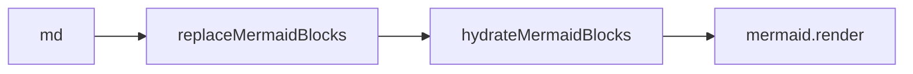

# LiteMD 技术文档

> 最后更新：2026-09-04（对齐当前代码快照 v0.2.11；0.2.11 修复项见 `doc/CHANGELOG.md` [0.2.11] 段）
> 历史文档已归档至 `doc/archive/`，如需追溯开发过程请查阅。
> 交叉导航：全流程文档地图见 [doc/README.md](./README.md)；设计原则与主题配色见 [design/PRINCIPLES.md](./design/PRINCIPLES.md)；测试矩阵与运行方式见 [test/TEST-MATRIX.md](./test/TEST-MATRIX.md)。

***

## 1. 架构总览

LiteMD 是一个桌面 Markdown 编辑器，技术栈：

- **桌面壳**：Wails v2（Go + WebView2，Windows / macOS / Linux）

- **后端**：Go（文件 IO、配置持久化、文件关联冷启动、单实例锁、图片资产复制）

- **前端**：原生 TypeScript（无框架），CodeMirror 6 编辑器，marked + DOMPurify 渲染管线

- **构建**：`build-win11-x64.sh` 一键交叉编译 Windows 产物（NSIS 安装包 + 便携版）

```
┌─────────────────────────────────────────────┐
│          Wails 无边框窗口（自绘标题栏）        │
│  ┌──────────────┬──────────────────────────┐ │
│  │  顶栏/标签栏   │  编辑器 (CodeMirror 6)    │ │
│  ├──────────────┼──────────────────────────┤ │
│  │  前端模块      │  预览 (marked+DOMPurify)  │ │
│  │  main/tabs/…  │   + KaTeX 公式            │ │
│  └──────────────┴──────────────────────────┘ │
│  ▲          Wails bindings (Go API)          │
└─┼───────────────────────────────────────────┘
  │
  ├── app.go（OpenFile/SaveFile/Config/图片复制）
  ├── startupfile.go（命令行/文件关联启动文件队列）
  ├── internal/config（~/.litemd/config.json）
  └── internal/fileio（原子写 + 安全守卫）
```

### 1.1 数据流：打开一个文件

```
双击 .md / 命令行参数
  → extractStartupFiles(argv) 入队（startupfile.go）
  → 前端启动后 while ConsumeStartupFile() 逐个消费（main.ts）
  → OpenFile(path) → fileio.ReadText（IsRegular + 50MB + UTF-8 校验）
  → FilePayload{path, content, modified} → tm.openTab()
```

单实例锁：第二次启动的文件关联会转发给已运行实例（`OnSecondInstanceLaunch` → 前端收到 `litemd:openExternalFile` 事件）。

### 1.2 数据流：保存

```
Ctrl+S → handleSave() → saveFile(path, content) → app.SaveFile
  → fileio.WriteText（临时文件 → Sync → Rename 原子写）
  → updateContentBaseline（推进 baseline，不覆盖 liveContent）
```

### 1.3 无边框标题栏（Frameless）

`main.go` 设 `Frameless: true`，系统标题栏被移除，顶栏（`.topbar`）兼任标题栏：
右侧集成最小化 / 最大化还原 / 关闭按钮（`.window-controls`），配色随暗/亮主题变量自适应。

**拖动机制**（Wails v2.14 `internal/frontend/runtime/desktop/main.js` 的 `dragTest`）：

```
mousedown → getComputedStyle(e.target).getPropertyValue("--wails-draggable") === "drag"
          且 e.buttons===1 且 e.detail===1（双击第二次跳过，留给 dblclick）
  → 置 shouldDrag
mousemove（按键仍按住）→ WailsInvoke("drag")
  → Go: ReleaseCapture + PostMessage(WM_NCLBUTTONDOWN, HTCAPTION) → 系统模态拖动
```

两条铁律（对应此前两个失效问题的根因）：

1. **必须用 CSS 变量** **`--wails-draggable: drag`**。`-webkit-app-region` 是
   Electron 专有属性，WebView2/Wails 完全不识别——此前拖不动即源于此。
2. **可交互元素必须显式** **`--wails-draggable: no-drag`**。CSS 变量可继承，
   若按钮从顶栏继承了 `drag`，点击时手抖 1px 就会触发 mousemove → 进入
   系统模态拖动循环，`click` 被吞（表现即"按钮失效"）。故 `.actions` 与
   `.window-controls` 均显式覆盖为 `no-drag`。

**窗口操作 API**（`frontend/src/titlebar.ts`，经依赖注入便于单测）：

| 操作     | API                      | 说明                                                                                         |
| ------ | ------------------------ | ------------------------------------------------------------------------------------------ |
| 最小化    | `WindowMinimise()`       | <br />                                                                                     |
| 最大化/还原 | `WindowToggleMaximise()` | 双击标题栏空白同样触发（Wails 不内建，`titlebar.ts` 补齐）                                                    |
| 关闭     | `requestQuit`            | 序列：前端 quitDialog 协商 → `SetUnsavedCount(0)` → `Quit()`。Wails 的 `Quit()` 同步调用 `OnBeforeClose`，清零防原生框二次弹出；**Wails v2 无** `WindowClose` |
| 状态同步   | `WindowIsMaximised()`    | Wails v2.14 Windows 不广播 `wails:maximise` 事件，改在 `resize` 上防抖 150ms 查询，切换 `.is-maximised` 图标 |

浏览器 mock 端（dev.html）无 `window.runtime`，`initTitlebar(null)` 自动隐藏控制按钮组。

***

## 2. 目录结构

```
LiteMD/
├── main.go                 # 入口：窗口配置、单实例锁、文件关联冷启动
├── app.go                  # Wails binding：文件/配置/图片 API
├── startupfile.go          # 启动文件队列（并发安全）
├── app_test.go / app_integration_test.go / startupfile_test.go
├── internal/
│   ├── config/             # ~/.litemd/config.json 持久化（主题/字号/最近文件）
│   ├── fileio/             # 文件读写（原子写 + safeWritePath 守卫）
│   └── links/              # 链接解析/外部打开/本地资源（v0.2.6，见 §4.1）
├── frontend/
│   ├── src/
│   │   ├── main.ts         # 应用主入口：事件绑定/快捷键/窗口流程
│   │   ├── titlebar.ts     # 无边框标题栏：窗口控制按钮/双击最大化/状态同步
│   │   ├── tabs.ts         # TabManager：标签生命周期 + dirty 状态
│   │   ├── editor.ts       # CodeMirror 6 封装
│   │   ├── preview.ts      # 渲染管线主流程（marked+DOMPurify+链接加固+全量点击拦截）
│   │   ├── user-css.ts     # 内嵌 CSS 安全层（<style> 作用域化 + style 属性过滤，v0.2.7）
│   │   ├── link-handler.ts # 链接分类纯函数（classifyHref/slug 生成，v0.2.6）
│   │   ├── latex.ts        # LaTeX 公式提取/渲染/还原（KaTeX）
│   │   ├── obsidian.ts     # Obsidian 语法：双链/callout/frontmatter
│   │   ├── file-ops.ts     # 与后端 binding 的桥接层
│   │   ├── splitpane.ts    # 分屏拖拽
│   │   ├── unsaved-guard.ts# 未保存拦截对话框
│   │   ├── mocks.ts        # 浏览器开发模式 mock
│   │   └── *.test.ts       # 测试（自制断言框架）
│   ├── index.html          # 生产入口
│   ├── dev.html            # 浏览器开发入口（含 mock）
│   └── vite.config.js      # 构建配置（含 KaTeX 字体裁剪插件）
├── nsis-src/              # NSIS 安装脚本（安装脚本事实源）
├── e2e/                    # E2E 脚本（sprint4~11 为有效回归集；1/2/3/5 历史脚本 bug 未修）
├── doc/                    # 技术文档（本文件 + CHANGELOG + archive/）
└── build-win11-x64.sh      # 一键构建脚本
```

***

## 3. 渲染管线（重要：顺序约束）

```
Markdown 源文本
  → ① extractLatex(md)          ← LaTeX 公式抽成占位符（随机盐）
  → ② preprocessAll(text)       ← Obsidian 双链 / callout / frontmatter
  → ③ marked.parse(html)        ← Markdown → HTML
  → ④ extractStyleBlocks(html)  ← 摘除 <style> 块（v0.2.7，防被 FORBID_TAGS 剥掉）
  → ⑤ DOMPurify.sanitize        ← 严格白名单清洗（style 属性经 hook 声明级过滤）
  → ⑥ hardenLinks(html)         ← 外链加 target=_blank + rel=noopener
  → ⑦ restoreLatex(html)        ← 占位符还原为 KaTeX HTML（仅文本节点）
  → ⑧ buildUserStyleTag(css)    ← 用户 CSS 作用域化后拼回 <style data-user-css>（v0.2.7）
```

**顺序为什么必须这样（两个硬约束）：**

1. **公式提取必须在 marked 之前**（① 先于 ③）：否则 `a_i * b_j` 里的 `*` 会被 marked 解析为斜体标记，公式被破坏。
2. **公式还原必须在 DOMPurify 之后**（⑦ 后于 ⑤）：KaTeX 输出依赖内联 `style` 属性与 MathML 标签，若在清洗前注入会被 DOMPurify 剥离。

**公式占位符的安全设计（2026-08-31 加固）：**

- 每次 `extractLatex` 生成**随机盐**（`Math.random + Date.now`），占位符形如 `LTMDPHLX<salt><n>ZX`，不可预测

- 提取阶段先把用户文本中所有「占位符形态」（`LTMDPHLX[A-Za-z0-9]*\d+ZX`）剥成空串

- `restoreLatex` 只在 `>...<` 之间的文本节点替换，**绝不触碰属性上下文**

- 双保险的意义：即使攻击者在文档里伪造占位符形态（旧版可借此把 KaTeX HTML 注入 `data-wikilink`、`title` 等属性，突破 DOMPurify 属性白名单），本实现也不构成注入面

**代码块豁免：**

- \`\`\` 围栏块、`行内代码`、`\$` 转义先被标记为豁免区间（`findExemptRanges`）

- 豁免区间**只标记位置、不替换内容** —— marked 必须还能看到反引号，否则代码块会降级成普通段落

- 未闭合围栏视作「开栏到文末为代码区」（与 marked 行为一致）

- 豁免区间查找为线性实现（按行状态机 + 二分），避免旧版 O(n²) ReDoS

### 3.1 DOMPurify 配置

```ts
ALLOWED_TAGS: a/p/div/span/em/strong/b/i/u/s/code/pre/blockquote/ul/ol/li/h1-h6/
              table/thead/tbody/tr/th/td/img/figure/figcaption/hr/br/details/summary/
              mark/kbd + v0.2.7: dl/dt/dd/caption/col/colgroup/abbr/q/cite/small/
              address/time/var/samp/bdi/bdo/wbr/video/audio/source/track/picture
ALLOWED_ATTR: v0.2.7 起 style 属性放行（经 hook 声明级过滤，见 3.2）
              + controls/loop/muted/preload/poster/width/height/colspan/rowspan/
              span/scope/datetime/start/reversed/open/dir/kind/srclang/label/type
FORBID_ATTR:  onerror/onload/onclick/onmouseover/onmouseout/onfocus/onblur/srcdoc
              （style 已从禁用列表移除，改由 hook 过滤）
ALLOWED_URI_REGEXP: https?:/mailto:/tel:/盘符(C:\)/本地路径 + data:image/(png|
              gif|jpeg|jpg|webp|avif|bmp|x-icon);base64,（v0.2.7，不含 svg+xml）。
              v0.2.11：本地路径分支改用负向前瞻排除 scheme: 形态后放行任意
              非 scheme 路径——覆盖中文文件名（% 编码）与盘符（v0.2.x 的
              ASCII 开头分支会误剥二者，审查 R1）；javascript:/vbscript:/
              file:/blob:/非图片 data: 照旧拒绝。盘符 C:\ 单独前置分支，
              否则冒号会被 scheme 前瞻误杀
```

注意：`style` 属性对 KaTeX 输出是**有意放行**的（公式还原发生在 DOMPurify 之后），这一层依赖 KaTeX `trust:false` 保证输出安全。v0.2.7 起用户 HTML 的 style 属性也放行，但每个声明值都会经过 `uponSanitizeAttribute` hook 的声明级过滤（黑名单 + url 白名单，见 4.2）。

### 3.2 内嵌 CSS（`<style>` 块与 style 属性，v0.2.7）

`user-css.ts` 提供三层能力，威胁模型见其头注释（UI 欺骗 / 外发跟踪 /
HTML 逃逸 / 旧 IE 向量 / data URI 收窄）：

- `extractStyleBlocks(html)`：`<style>` 块非贪婪摘取（与浏览器 raw-text
  解析语义一致——CSS 字符串内的 `</style>` 同样会提前终止）；

- `scopeUserCss(css)`：手写 CSS 重写器——`@media/@supports/@container`
  递归前缀化、`@keyframes` 内部不前缀、`@font-face` 等声明型 at-rule 仅
  过滤声明、`html/body/:root` 映射为 `.preview-content` 本体、`@import`
  等无块 at-rule 与嵌套规则（Nesting）整块丢弃；

- `filterInlineStyle(css)`：声明级黑名单——`position` 仅 relative/static、
  `z-index`/`top/right/bottom/left/inset` 丢弃、`expression/behavior/
  -moz-binding` 丢弃、含 `//` 的值丢弃（覆盖 url()/image-set()/src() 全部
  加载函数）、`url()` 仅放行 `#fragment` 与 `data:`。

预览 DOM 结构：`#preview(.preview, 滚动容器) > .preview-content(作用域
边界, BFC)`，用户 CSS 选择器一律被前缀化为 `.preview-content …`，最远
只影响预览区内部；`buildUserStyleTag` 输出前转义 `</style` 防 HTML 逃逸。

### 3.3 Mermaid 图表（v0.2.8）



- **动态 import**：`import("mermaid")` 由 vite 自动分到独立 chunk（按图种
  分包，cynefin 等典型图 690KB/155KB gzip），主 JS 不内联——文档无
  mermaid 时启动零开销。

- **图级缓存（LRU 64）**：缓存键 `theme + \0 + code`，切 tab / 撤销重做 /
  主题切换前同图零开销。

- **`securityLevel: 'strict'`**：禁用 click 回调与危险 HTML，href 协议白名单；
  输出 SVG 通过 innerHTML 注入（依赖 strict 净化）。

- **`startOnLoad: false`**：杜绝 mermaid 自动扫文档渲染（仅在用户主动
  Preview\.render 后由 hydrateMermaidBlocks 显式调用 render）。

- **竞态防护**：与图片解析同款——`renderGen` + `holder.isConnected` 双
  守卫，快速切 tab 时过期渲染直接丢弃。

- **主题切换**：`applyTheme` 末尾 `preview.onThemeChange(theme)`；onThemeChange
  不重 render 整文档，仅对已有 `.mermaid-block` 重新水合（缓存按 theme
  隔离）。

- **失败降级**：`renderMermaid` 返回 `null` → `.is-error` 容器保留原码 +
  错误文案，便于校对修改。

- **测试接缝** **`setMermaidLoader`**：node/jsdom 注入 fake 模块，避开 939KB
  真 chunk 下载；浏览器/E2E 走真实 dynamic import。

### 3.4 LaTeX 公式语法

- 行内：`$...$`（紧邻定界符不得为空白，避免货币误判）

- 块级：`$$...$$`

- 代码块/行内代码/`\$` 内不渲染

KaTeX 配置：`trust:false`（禁 `\href`/`\url`/`\htmlClass`/`\htmlStyle`/`\htmlData`/`\includegraphics`）、`maxSize:50`、`maxExpand:1000`、`throwOnError:false`。

> ⚠️ KaTeX 版本约束：**不得低于 0.16.21**（CVE-2025-23207 修复版本，漏洞点正是本方案依赖的属性校验路径）。

***

## 4. 安全模型

| 层  | 职责                                                                      | 位置                   |
| -- | ----------------------------------------------------------------------- | -------------------- |
| 1  | 公式占位符防伪（随机盐 + 剥除）                                                       | `latex.ts`           |
| 2  | Obsidian 预处理转义（双链属性过滤）                                                  | `obsidian.ts`        |
| 3  | marked 解析                                                               | `marked`             |
| 4  | DOMPurify 严格白名单                                                         | `preview.ts`         |
| 5  | 外链加固（target/rel）                                                        | `preview.ts`         |
| 6  | 公式还原（仅文本节点）                                                             | `latex.ts`           |
| 7  | DOM 兜底 scrub（移除 on\* / javascript:）                                     | `preview.ts`         |
| 8  | 写路径守卫（绝对路径/Clean/Windows 保留设备名）                                         | `fileio/safepath.go` |
| 9  | 链接点击全量拦截（杜绝 WebView 导航到 wails.localhost 未知路径）                           | `preview.ts`         |
| 10 | 外部打开 scheme 白名单（http/https/mailto/tel）+ 本地路径解析守卫                        | `internal/links`     |
| 11 | 内嵌 CSS 作用域隔离（声明黑名单 + url 白名单 + `.preview-content` 前缀 + `</style` 转义）    | `user-css.ts`        |
| 12 | Mermaid securityLevel strict + startOnLoad false + LRU 缓存 + 竞态防护 + 错误降级 | `mermaid.ts`         |

**原则**：DOMPurify 是唯一且充分的 HTML 清洗层；KaTeX 输出注入是设计上的例外，依赖 `trust:false` + 占位符防伪双重保护。

**跨语言错误契约**：Wails v2 把 binding error 序列化为字符串，前端无法
`errors.Is`，只能对 message 做子串匹配。前端 `main.ts` 依赖三个 Go sentinel
的精确文案：`fileio.ErrExternalModified`（保存冲突检测）、`links.ErrNoBase`
（未保存引导）、`links.ErrNotLocal`（外链兜底）。文案由
`app_test.go` 的 `TestErrorTextContractForFrontend` 钉死——修改任一 sentinel
文本会让该测试失败，防止前端分支静默失效。

### 4.1 预览链接与本地资源（v0.2.6）

预览区跑在 `http://wails.localhost` 源上，放任 `[文本](../a.md)` 的默认行为
会让 WebView **就地导航**到不存在的 HTTP 路径 → 404 → 整个 SPA 被卸载（卡死、
未保存内容丢失）。因此点击被三层处理：

```
点击 <a> ──► preview.ts preventDefault（click + auxclick，含 Ctrl/中键）
              │ classifyHref：external / mail / anchor / local / unsafe
              ▼
         main.ts 分流
          ├─ external/mail ──► OpenExternal（Go 白名单校验）→ 系统浏览器
          ├─ anchor ──► 预览区内滚动（h1-h6 自动补 slug id）
          └─ local ──► ResolveLocalPath（Go：解码/file://剥离/盘符/UNC/../折叠）
                        ├─ markdown|text ──► OpenFile → 新标签（含去重）
                        ├─ other ──► 二次确认 → OpenPath（系统默认程序）
                        ├─ dir ──► 提示
                        ├─ missing ──► 提示"文件不存在"
                        └─ 未保存文档 ──► 引导先保存（ErrNoBase）
兜底：assetserver navGuard Middleware —— 任何未命中资源的 GET 302 回
/?nav=<路径>，前端浮层提示，永不白屏。
```

无扩展名目标按 Obsidian 约定嗅探文件头（≤8KB、无 NUL、合法 UTF-8）归为
Markdown。相对路径图片经 `ResolveLocalPath` + `ReadLocalAsset`（≤10MB、
图片扩展名白名单）异步回填 data URL，`renderGen` 防串版。

***

## 5. 后端模块

### 5.1 fileio（文件读写）

- `ReadText`：IsRegular 校验（拒绝 FIFO/设备/伪文件）→ 50MB 上限 → LimitReader 兜底 → BOM 剥除 → UTF-8 校验

- `WriteText` / `WriteBase64File`：临时文件 → `Sync()` → `Rename` 原子写

- `safeWritePath`：绝对路径 + Clean + Windows 保留设备名（CON/NUL/AUX/COM1-9/LPT1-9）拒绝

### 5.2 config（配置持久化）

- 路径：`~/.litemd/config.json`

- 字段：`theme` / `fontFamily` / `fontSize` / `recentFiles`（**最小集**，无窗口尺寸/KeyMap 等预留字段）

- 原子写 + Sync；损坏时降级默认值

- 线程安全：`Store.mu` 保护读写

> 注意：前端当前**不消费** `GetConfig`/`SetConfig`（主题存于 localStorage）。`recentFiles` 由 `PushRecent` 写入。

### 5.3 启动文件与单实例

- 冷启动：argv 中非程序路径入队 → 前端 `ConsumeStartupFile()` 逐个消费

- 单实例：`SingleInstanceLock` 三平台生效，二次启动转发参数 → `litemd:openExternalFile` 事件

- macOS Finder 双击打开（v0.2.9 已实装）：`main.go` 注册
  `mac.Options.OnFileOpen`（commit 729e1b7），复用 `startupFiles` 队列 +
  `notifyExternalOpen` 兜底（回调先于 startup 时置 `pendingNotify`，startup
  后由 `flushPendingNotify` 补发）。
  `app_test.go:TestOnFileOpen_PushAndNotify` 覆盖：合法 .md 入队 + startup
  后补发、`extractStartupFiles` 拒非 Markdown 后缀（落盘 .exe 后不入队）、
  空路径拒。

***

## 6. 构建与打包

### 6.1 一键构建（Windows 11 x64）

```bash
export GOTOOLCHAIN=auto
cd frontend && npm ci && cd ..
OUT=/path/to/dist ./build-win11-x64.sh
```

产物：

| 产物                                 | 说明                  |
| ---------------------------------- | ------------------- |
| `LiteMD-<版本>-Setup-x64.exe`        | NSIS 安装版（LZMA 固实压缩） |
| `LiteMD-<版本>-Portable-x64.zip`     | 便携版（解压即用）           |
| `LiteMD-<版本>-Portable-x64-upx.zip` | UPX 压缩便携版（可选产物）     |

### 6.2 体积优化策略（已落地）

| 优化                                             | 效果                              |
| ---------------------------------------------- | ------------------------------- |
| `-webview2 browser` + 自定义 NSIS 宏（检测注册表，不内嵌引导器） | 安装包 -43%（6.01MB → 3.43MB）       |
| LZMA 固实压缩（`/SOLID lzma` + `DictSize 32`）       | 进一步压缩                           |
| `-ldflags "-s -w"` + `-trimpath`               | 剥离符号 + 可复现构建（跨构建 exe SHA256 一致） |
| Vite 插件剥离 woff/ttf 字体引用（KaTeX）                 | dist 2.2MB → 1.3MB              |
| 不用 UPX 压缩安装包（杀软误报风险 > 3% 收益）                   | 仅便携版可选                          |

### 6.3 WebView2 策略

安装包**不内嵌** WebView2 运行时。安装时检测注册表（HKLM/HKCU），缺失则提示下载地址但**不阻断安装**。Win11 通常已自带。

***

## 7. 测试

### 7.1 运行方式

```bash
# Go（含 race 检测）
go test ./... -race -count=1

# 前端全部（父/子进程隔离运行器：LITEMD_TEST=all 时每个套件在独立子进程执行，
# 环境变量 LITEMD_SUITE 选择单套件；npm test 为等价入口）
cd frontend && LITEMD_TEST=all npx tsx src/preview.test-bootstrap.ts

# 前端单套
cd frontend && LITEMD_TEST=latex npx tsx src/preview.test-bootstrap.ts
cd frontend && LITEMD_TEST=titlebar npx tsx src/preview.test-bootstrap.ts
```

### 7.2 当前统计（2026-09-03，v0.2.9）

| 套件                                 | 断言/用例数                                                                      |
| ---------------------------------- | --------------------------------------------------------------------------- |
| Go（main + config + fileio + links） | 69 个 Test 函数（含关闭守卫 app\_close\_test.go、二实例通知 app\_notify\_test.go、navguard） |
| preview\.test.ts                   | 91（含分块增量渲染）                                                                 |
| user-css.test.ts                   | 64（前缀化/at-rule 分支/声明黑名单/逃逸转义）                                               |
| obsidian.test.ts                   | 45（含 ReDoS 防护 9 项）                                                          |
| latex.test.ts                      | 59（含占位符防伪 + ReDoS 守卫 + 闸门 9 例）                                              |
| titlebar.test.ts                   | 17（按钮/手势/状态同步/降级）                                                           |
| tabs.test.ts                       | 21                                                                          |
| link-handler.test.ts               | 23（链接分类/锚点切分/slug 生成）                                                       |
| toc.test.ts                        | 22                                                                          |
| md-escape.test.ts                  | 9                                                                           |
| mermaid.test.ts                    | 25（缓存/主题隔离/失败三分/超时/串行）                                                    |
| font-size.test.ts                  | 16（钳位/持久化/CSS 写入/隐私模式降级）                                                   |
| E2E sprint4\~11                    | 全绿（sprint4 16 / sprint6 29 / sprint7 30 / sprint8 14 / sprint9 26 / sprint10 28 / sprint11 新增） |

E2E 断言接缝：`window.__litemd__bindings` 暴露 binding 包装函数；
`window.__litemd__unsavedCount` 记录 mock 侧最近一次 `SetUnsavedCount` 上报值。

### 7.3 安全专项测试

- 占位符伪造：wiki-link / img title 属性内占位符形态被剥除

- 占位符盐每次不同

- 还原不触碰属性上下文

- `WIKI_RE` / `FENCE_RE` ReDoS 回归守卫（大输入 < 500ms 断言）

- KaTeX `trust:false` 注入（\href/\htmlClass/\<script>）

- 宏展开炸弹（maxExpand 限制）

***

## 8. 已知限制与待办

### 8.1 已知限制

- E2E 失效脚本 sprint1/2/3/5 已降级归档到 `e2e/SPRINT-LEGACY-README.md`（**有效集 sprint4~11**），sprint12 迁回再恢复

- 前端 GetConfig/SetConfig 仍主要给主题持久化用，**字号/侧栏宽/同步滚动偏好** 用 localStorage（频繁读写不值得跨 IPC 边界；如未来字段增多再统一到 Config，R7 备注）

- 无外部文件变更检测（用户决策取消目录监控）

- 内嵌 CSS 不支持 CSS Nesting（嵌套规则块整块丢弃）与 `@import`/
  `@layer`；远程字体 `url()` 不可用（仅 `data:` 内联），v0.2.7 设计取舍

- navGuard 中间件经 `httptest.Recorder` 全量缓冲响应再拷贝（主 chunk
  \~1MB 双份内存）；本地 assetserver 无实测瓶颈，按「无瓶颈不重构」保留
  （R2 维持原状态；R10 触发时再顺带优化）

- 自动更新模块已移除（v0.2.0 曾有，2026-08-31 e64af52 删除，见 CHANGELOG 勘误）

- **错误码体系依赖文案前缀**：所有 binding error 在文案前挂 `[code]`
  前缀（`errcode.go:CodeOf` 解析），改任一端文案都会被
  `TestErrorTextContractForFrontend` + `errcode.test.ts` 拦截（审计 R2-F1）

- **fileio 错误文案不外发完整路径**：`publicPath` helper 保证
  `~/.ssh/id_rsa` 等敏感路径只露 basename（审计 R2-G1）

- **macOS Finder "打开方式 .exe" 拦截**：`extractStartupFiles` 经
  `links.CheckEditable` 过滤，Finder 选 .exe 不入队（审计 R2-G3）

### 8.2 待办（v0.2.9 + R2 审计后更新）

> **R1 审计**（[AUDIT-2026-09-03.md](../audit/AUDIT-2026-09-03.md)）落地 P1 三项：
> `OnBeforeClose` 协商、保存重构（`updateContentBaseline` 不覆盖
> liveContent）、`PushRecent` 事务化（`store.Mutate`）—— 全部并入 v0.2.9。
>
> **R2 审计**（[AUDIT-2026-09-03-R2.md](../audit/AUDIT-2026-09-03-R2.md)）落地 20 P1：
> F1 错误码体系 + G1-G11 后端加固 + F2-F17 前端清理—— 全部并入 [未发布] 段。
> P2 全部修复，剩余 0 P1 / 0 P2。

| 优先级 | 项                                                   | 位置                   |
| --- | --------------------------------------------------- | -------------------- |
| P1  | E2E sprint12：把 sprint1/2/3/5 迁到 `__litemd__bindings` 注入 + 移除自动更新项 | `e2e/`              |

***

## 9. 变更记录

完整变更历史见 `doc/CHANGELOG.md`。近期关键变更：

- **2026-08-31（无边框标题栏 v2）**：`Frameless: true` + 自绘窗口控制按钮；修复拖动失效（`-webkit-app-region` → `--wails-draggable`）与按钮失效（no-drag 显式覆盖）；双击标题栏最大化、resize 防抖状态同步；titlebar.test.ts 11 项

- **2026-08-31（P0 修复版）**：ReadText 伪文件防护、原子写 Sync、写路径守卫、setContent 不入 undo 历史；占位符加盐防伪造、FENCE/inRanges 线性化（ReDoS）

- **2026-08-31（回退版）**：撤销无边框自定义标题栏，恢复系统原生

- **2026-08-30**：新增 LaTeX 公式渲染（KaTeX）；体积优化；文件关联冷启动 + 单实例锁

