# 🧪 Markdown 全语法兼容性测试文档

> [!abstract] 测试说明
> 本文档用于测试编辑器对以下语法的渲染兼容性：
> 1. **CommonMark / GFM** 标准 Markdown
> 2. **Obsidian 扩展语法**（Wiki链接、Callouts、嵌入、注释、Properties）
> 3. **LaTeX / KaTeX 数学公式**
> 4. **HTML / CSS 内嵌渲染**
> 5. **Mermaid 图表**（含 v10/v11 新图表类型）
> 6. **多语法交叉嵌套工况**
>
> 每个测试项前有 `- [ ]`，通过请勾选。

%% 这是 Obsidian 注释语法，预览模式下应完全不可见。
   如果这段文字出现在渲染结果中，说明注释语法未受支持。 %%

---

## 第一部分：标准 Markdown（CommonMark / GFM）

### 1.1 标题层级（H1–H6）

- [ ] 以下标题应逐级缩小：

# 一级标题 H1
## 二级标题 H2
### 三级标题 H3
#### 四级标题 H4
##### 五级标题 H5
###### 六级标题 H6

- [ ] Setext 风格标题：

Setext 一级标题
===============

Setext 二级标题
---------------

### 1.2 文本样式与强调

- [ ] 基础样式：**粗体**、*斜体*、***粗斜体***、~~删除线~~、==高亮==、`行内代码`
- [ ] 下划线变体：__粗体下划线式__、_斜体下划线式_
- [ ] 混合嵌套：**粗体中嵌套*斜体*和~~删除线~~与`代码`**
- [ ] 上标/下标（GFM 部分支持）：X^2^ 与 H~2~O
- [ ] 转义字符：\*非斜体\* \#非标题 $$非链接$$ \`非代码\* \\ \$ \_ \~
- [ ] 行内格式符不匹配时应保留原样：**未闭合粗体 与 *未闭合斜体
- [ ] 单词内下划线不应触发强调：snake_case_name_with_underscores
- [ ] 中英混排强调：**加粗中文 English Bold** 和 *斜体中文 English Italic*

### 1.3 段落、换行与分隔线

第一段。段落之间由空行分隔。这是同一段的第二句，应与上一句连排。
这是软换行（无两空格），GFM 中可能与上行合并。
这是硬换行（行尾两空格）  
换行后另起一行。

- [ ] 分隔线（三种写法均应渲染为水平线）：

---

***

___

### 1.4 列表

- [ ] 无序列表（三种标记符）：

- 减号项
* 星号项
+ 加号项

- [ ] 有序列表与混合嵌套：

1. 一级有序项
   2. 二级有序项
      - 三级无序项
         - [x] 四级已完成任务
         - [ ] 四级未完成任务
            1. 五级项（深层缩进压力测试）
3. 起始编号非 1 的列表应从 3 开始：

4. 第三项
5. 第四项

- [ ] 松散列表（项间有空行，应渲染 `<p>`）：

* 松散项一

* 松散项二

- [ ] 任务列表：
  - [ ] 未完成任务
  - [x] 已完成任务
  - [ ] 任务项中包含 **格式** 和 [链接](https://example.com) 和 `代码`

### 1.5 引用块

> 一级引用。
>
> 一级引用第二段。
>
> > 二级嵌套引用。
> >
> > > 三级嵌套引用。
> > > - 引用中的列表
> > > - 引用中的 **粗体** 与 *斜体*
> > >
> > > | 引用中的表格 | 列2 |
> > > |---|---|
> > > | 单元格 | 单元格 |

### 1.6 代码

- [ ] 行内代码：`const x = 42;`，以及包含反引号的行内代码：`` `code` ``
- [ ] 围栏代码块（语法高亮测试）：

```python
def fibonacci(n: int) -> list[int]:
    """计算斐波那契数列 # 注释不应影响字符串"""
    a, b = 0, 1
    for _ in range(n):
        yield a
        a, b = b, a + b
```

```javascript
const obj = { key: "value", num: 123 };
console.log(`模板字符串 ${obj.key}`);
// 代码块中的 Markdown 符号不应被解析：**粗体**  $公式$
```

```html

```

- [ ] 缩进式代码块（4空格）：

    这是缩进代码块
    应保持等宽字体

- [ ] 四反引号围栏嵌套三反引号（嵌套围栏压力测试）：

````markdown
外层围栏，内部包含代码块：
```python
print("嵌套围栏")
```
````


### 1.7 链接

- [ ] 行内链接：[Example](https://example.com)
- [ ] 带标题链接：[Example](https://example.com "鼠标悬停标题")
- [ ] 引用式链接：[引用链接][ref1] 与 [简写引用][ref2]
- [ ] 自动链接：<https://example.com> 与邮件 <test@example.com>
- [ ] 裸 URL 自动识别（GFM）：https://www.github.com
- [ ] 锚点链接：[跳转到 1.7 链接](#17-链接)
- [ ] 相对路径链接：[同目录文件](./README.md)
- [ ] 链接嵌套格式：[**粗体链接**](https://example.com)、[含`代码`的链接](https://example.com)
- [ ] 图片链接：[](https://example.com)
- [ ] 含括号的 URL：[维基百科](<https://zh.wikipedia.org/wiki/Markdown_(语法)>)

[ref1]: https://example.org "引用定义1"
[ref2]: https://example.net

### 1.8 图片

- [ ] 基础图片（外链，加载失败时应显示 alt 文本）：
  
- [ ] 带标题图片：
- [ ] HTML 控制尺寸图片：`` 见第四部分

### 1.9 表格（GFM）

- [ ] 对齐方式测试：

| 左对齐                       |                  居中对齐                  |         右对齐 | 默认     |
| :------------------------ | :------------------------------------: | ----------: | ------ |
| 文本                        |                   文本                   |          文本 | 文本     |
| **粗体**                    |                  *斜体*                  |        `代码` | ~~删除~~ |
| [链接](https://example.com) |  |    $E=mc^2$ | ^^注1   |
| 含管道符 `\|` 的单元格            |            长内容长内容长内容长内容长内容             | 中文English混排 | ✅      |

- [ ] 不等列数容错（多余/缺失单元格不应崩溃）：

| 列A   | 列B  | 列C  |
| ---- | --- | --- |
| 只有两格 | 测试  |     |

### 1.10 脚注

- [ ] 脚注引用与渲染：这是一个脚注引用[^1]，另一个[^note]，行内脚注^[这是行内脚注，部分渲染器支持]。

[^1]: 第一条脚注，包含 **格式** 与 `代码`。
[^note]: 命名脚注。
    脚注的第二段（缩进续行）。

### 1.11 表情与特殊字符

- [ ] Emoji shortcode：:smile: :+1: :warning: :heart:
- [ ] Unicode Emoji 直出：😀 🎉 ⚠️ ❤️ 🚀
- [ ] HTML 实体：&copy; &amp; &lt; &gt; &nbsp; &hellip; &mdash;
- [ ] 特殊 Unicode：→ ← ↑ ↓ ⇒ ⇔ ✓ ✗ ①②③ ㈱ §¶† ‰

---

## 第二部分：Obsidian 扩展语法

### 2.1 Wiki 链接与嵌入

- [ ] 内部双链：[[不存在的笔记]]（应显示为未创建链接样式）
- [ ] 带别名双链：[[不存在的笔记|显示为别名]]
- [ ] 指向标题：[[不存在的笔记#二级标题]]
- [ ] 指向块引用：[[不存在的笔记#^block-id]]
- [ ] 嵌入笔记：![[不存在的笔记]]
- [ ] 嵌入标题片段：![[不存在的笔记#1.1 标题层级（H1–H6）]]
- [ ] 嵌入图片：![[不存在的图片.png]]
- [ ] 嵌入图片并调尺寸：![[不存在的图片.png|200]] 与 ![[不存在的图片.png|200x100]]
- [ ] 嵌入 PDF：![[不存在的文档.pdf]]
- [ ] Obsidian URI：[打开笔记](obsidian://open?vault=TestVault&file=Test)

### 2.2 块引用与块 ID

- [ ] 下面段落带块 ID，可被 `#^test-block` 引用：

这是一个带块标识符的段落，块引用应能定位到它。 ^test-block

### 2.3 标签

- [ ] 行内标签：#测试标签 #嵌套/子标签 #English_Tag
- [ ] 标签不应误判：#1 不是标签（数字开头），# 后无内容不是标签
- [ ] 代码内标签不生效：`#不是标签`，```#也不是```

### 2.4 Callouts（全部类型 + 工况）

- [ ] 12 种基础类型：

> [!note] note 笔记
> 内容。

> [!abstract] abstract / summary / tldr 摘要
> 内容。

> [!info] info 信息
> 内容。

> [!todo] todo 待办
> 内容。

> [!tip] tip / hint / important 提示
> 内容。

> [!success] success / check / done 成功
> 内容。

> [!question] question / help / faq 疑问
> 内容。

> [!warning] warning / caution / attention 警告
> 内容。

> [!failure] failure / fail / missing 失败
> 内容。

> [!danger] danger / error 危险
> 内容。

> [!bug] bug 缺陷
> 内容。

> [!example] example 示例
> 内容。

> [!quote] quote / cite 引用
> 内容。

- [ ] 自定义标题与可折叠：

> [!info]- 折叠（默认收起）
> 点开后可见内容。

> [!tip]+ 可折叠（默认展开）
> 内容可见。

- [ ] Callout 嵌套与复杂内容：

> [!warning] 外层警告
> 外层文本。
>
> > [!success] 内层成功
> > 内层文本。
>
> - Callout 内列表项 1
> - 列表项 2
>   - [ ] 任务项
>
> 1. 有序项
> 2. 有序项
>
> | Callout内表格 | 列2 |
> |---|---|
> | A | B |
>
> ```python
> print("Callout 内代码块")
> ```
>
> Callout 内公式：$e^{i\pi}+1=0$ 与脚注引用[^1]。

### 2.5 Obsidian 内其他工况

- [ ] 多行注释不可见测试 %%注释内容%%
- [ ] 高亮语法 ==这是高亮文本==，嵌套 ==高亮中**粗体**==
- [ ] Frontmatter 中 tags/aliases/cssclasses 是否被编辑器识别（本文档开头）

---

## 第三部分：LaTeX / KaTeX 数学公式

### 3.1 行内公式

- [ ] 行内公式：质能方程 $E = mc^2$，勾股定理 $a^2+b^2=c^2$，希腊字母 $\alpha, \beta, \gamma, \Gamma, \Omega$。
- [ ] 转义工况：1 美元 \$ 与 2 美元 $ 之间不应触发公式；公式内空格 $x\ y$；中文与公式混排：设速度为 $v=3\,\text{m/s}$，则动能为 $E_k$。
- [ ] `$` `$` 定界符（MathJax 支持）：$ f(x)=x^2 $

### 3.2 块级公式

- [ ] 基础块级：

$$
\int_{-\infty}^{+\infty} e^{-x^2}\,dx = \sqrt{\pi}
$$

- [ ] 求和与极限：

$$
\sum_{n=1}^{\infty} \frac{1}{n^2} = \frac{\pi^2}{6} \qquad \lim_{x \to 0} \frac{\sin x}{x} = 1
$$

- [ ] 分式与根式：

$$
\frac{\frac{a}{b}}{\frac{c}{d}} \quad \sqrt[3]{27} = 3 \quad \cfrac{1}{1+\cfrac{1}{1+\cfrac{1}{2}}}
$$

- [ ] 矩阵（四种环境）：

$$
A = \begin{pmatrix} a_{11} & a_{12} \\ a_{21} & a_{22} \end{pmatrix}
\quad
B = \begin{bmatrix} 1 & 0 \\ 0 & 1 \end{bmatrix}
\quad
C = \begin{vmatrix} x & y \\ z & w \end{vmatrix}
\quad
D = \begin{cases} x^2 & x \ge 0 \\ -x & x < 0 \end{cases}
$$

- [ ] 多行对齐与编号：

$$
\begin{aligned}
\nabla \cdot \mathbf{E} &= \frac{\rho}{\varepsilon_0} \\
\nabla \cdot \mathbf{B} &= 0 \\
\nabla \times \mathbf{E} &= -\frac{\partial \mathbf{B}}{\partial t}
\end{aligned}
\tag{Maxwell}
$$

- [ ] 大型运算符与上下限：

$$
\bigcup_{i=1}^{n} A_i \quad \bigcap_{i=1}^{n} A_i \quad \prod_{k=1}^{n} k = n! \quad \iiint_V \rho\, dV
$$

- [ ] 箭头、关系符与逻辑符：

$$
\Rightarrow \Leftrightarrow \longrightarrow \xrightarrow{\text{上面}} \neq \approx \equiv \leq \geq \ll \gg \subset \supseteq \in \notin \forall \exists \neg \land \lor
$$

- [ ] 字体与样式：

$$
\mathbb{R}\ \mathcal{L}\ \mathfrak{g}\ \mathbf{v}\ \mathsf{T}\ \mathtt{mono}\ \overline{xy}\ \hat{a}\ \vec{v}\ \dot{x}\ \ddot{x}\ \tilde{n}\ \underbrace{a+b}_{\text{和}}\ \overbrace{c+d}^{\text{上}}
$$

- [ ] 颜色（KaTeX `\color`）：

$$
\color{red}{红色}\ \color{#4caf50}{自定义色}\ \colorbox{yellow}{黑字黄底}
$$

- [ ] `\text` 中文混排：

$$
\text{设 } x = 1\text{，则 } y = \text{中文与数学 } \alpha \text{ 混排}
$$

- [ ] 化学式（mhchem 扩展，部分渲染器支持）：

$$
\ce{H2SO4 + 2NaOH -> Na2SO4 + 2H2O}
$$

- [ ] 错误容错：下列公式含未定义命令，应显示红色错误而非崩溃：

$$
\undefinedcommand{test}
$$

---

## 第四部分：HTML 与 CSS

### 4.1 块级 HTML 元素

- [ ] div / p / pre 直出：

<div style="padding: 12px; border: 2px dashed #4a90d9; border-radius: 8px; background: #f0f7ff;">
  <p>这是一个带样式的 <code>div</code> 容器，含 <strong>粗体</strong> 与 <em>斜体</em>。</p>
</div>

- [ ] details 折叠元素：

<details>
  <summary>点击展开（details/summary）</summary>
  <p>展开后的内容。</p>
  <ul><li>列表项</li></ul>
</details>

- [ ] HTML 表格（含 rowspan/colspan）：

<table>
  <thead>
    <tr><th>功能</th><th colspan="2">合并列测试</th></tr>
  </thead>
  <tbody>
    <tr><td rowspan="2">合并行</td><td>A1</td><td>B1</td></tr>
    <tr><td>A2</td><td>B2</td></tr>
    <tr><td colspan="3" style="text-align:center; color:#c0392b;">居中红色文字</td></tr>
  </tbody>
</table>

- [ ] 键盘与语义标签：<kbd>Ctrl</kbd> + <kbd>C</kbd>、<mark>mark高亮</mark>、<abbr title="HyperText Markup Language">HTML</abbr>、<del>del删除</del>、<ins>ins插入</ins>、<sub>下标</sub>与<sup>上标</sup>、<small>small小字</small>、<code>code</code>、<samp>samp</samp>、<var>var</var>

### 4.2 行内样式与文本控制

- [ ] font/color 兼容性：<font color="red">红色font标签</font>、<span style="color:#8e44ad;font-weight:bold;">紫色粗体span</span>、<span style="background:linear-gradient(90deg,#ff6b6b,#4ecdc4);padding:2px 8px;border-radius:4px;">渐变背景</span>
- [ ] 字号与字体：<span style="font-size:0.8em;">小字</span>、<span style="font-size:1.5em;">大字</span>、<span style="font-family:'Courier New',monospace;">等宽字体</span>
- [ ] 文本装饰：<span style="text-decoration:underline wavy red;">红色波浪下划线</span>、<span style="letter-spacing:3px;">字间距</span>
- [ ] 换行与空白：第一行<br>第二行<br/>第三行（br 三种写法）

### 4.3 媒体元素

- [ ] img 带属性：
  
- [ ] audio（加载失败应优雅降级）：
  <audio controls src="https://example.com/test.mp3" style="width:100%;"></audio>
- [ ] video：
  <video controls width="320" poster="https://via.placeholder.com/320x180">
    <source src="https://example.com/test.mp4" type="video/mp4">
    浏览器不支持 video。
  </video>
- [ ] iframe 嵌入（安全策略测试）：
  <iframe src="https://example.com" width="100%" height="150" style="border:1px solid #ccc;"></iframe>

### 4.4 内嵌 CSS（style 块）

- [ ] 文档级 `<style>` 是否生效：

<style>
.md-test-card {
  padding: 16px;
  margin: 8px 0;
  border-left: 4px solid #e67e22;
  background-color: #fdf6ec;
  font-family: sans-serif;
  transition: transform 0.2s;
}
.md-test-card:hover { transform: translateX(4px); }
.md-test-card .title { font-size: 1.2em; color: #e67e22; font-weight: bold; }
</style>

<div class="md-test-card">
  <div class="title">CSS 类选择器测试卡片</div>
  <p>如果此卡片有橙色左边框和米色背景，说明 &lt;style&gt; 块与 class 生效；悬停应有位移动画。</p>
</div>

### 4.5 HTML 安全与容错

- [ ] 未闭合标签容错：<b>粗体未闭合
- [ ] script 标签应被过滤（XSS 防护）：<script>alert("若弹出说明不安全")</script>
- [ ] 注释节点：<!-- HTML 注释应不可见 -->
- [ ] Markdown 与 HTML 同段混排：这是普通文本 <b>HTML粗体</b> 继续普通文本 **Markdown粗体** 结束。

---

## 第五部分：Mermaid 图表（含 v10/v11 新类型）

### 5.1 流程图 Flowchart

- [ ] 节点形状 + 连线类型 + 子图 + 样式：

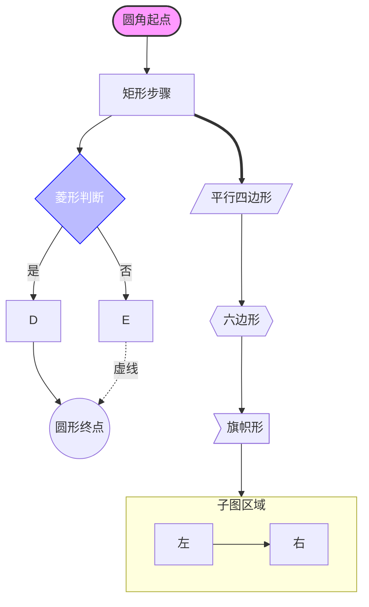

### 5.2 时序图 Sequence

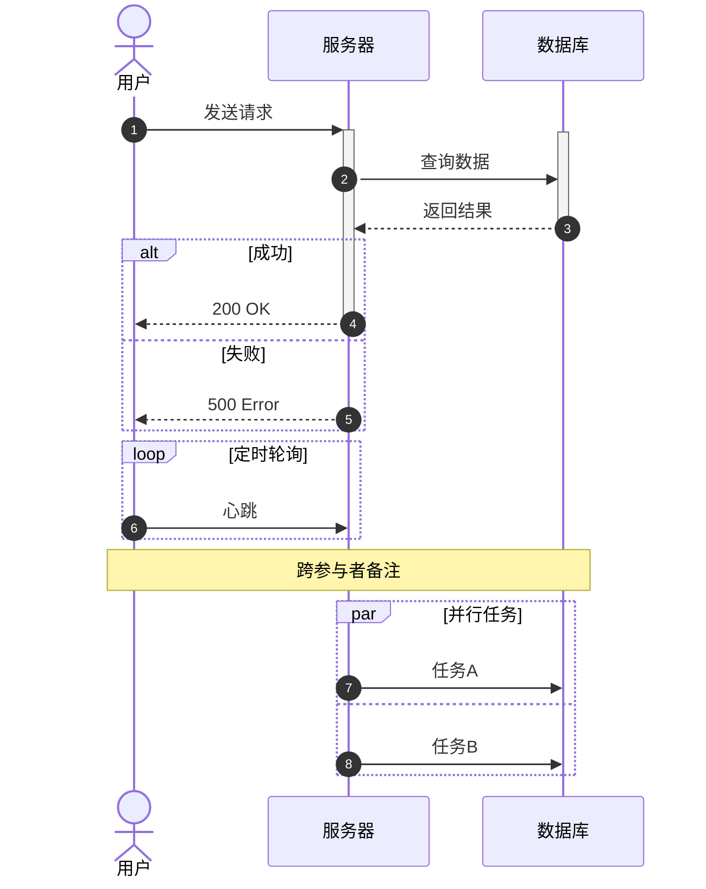

### 5.3 类图 Class

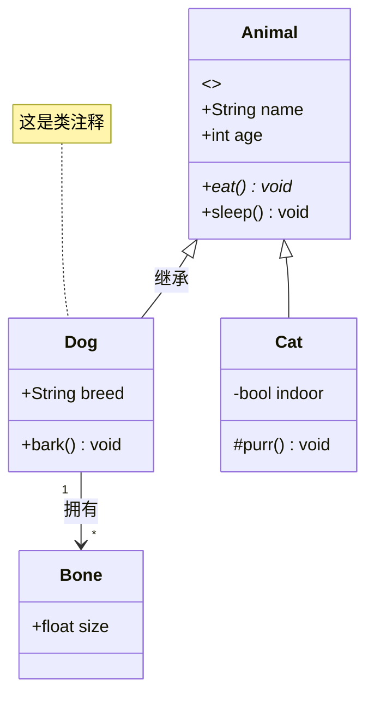

### 5.4 状态图 State

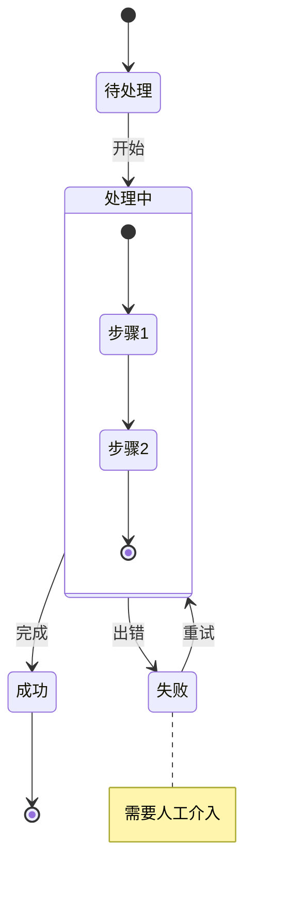

### 5.5 ER 图

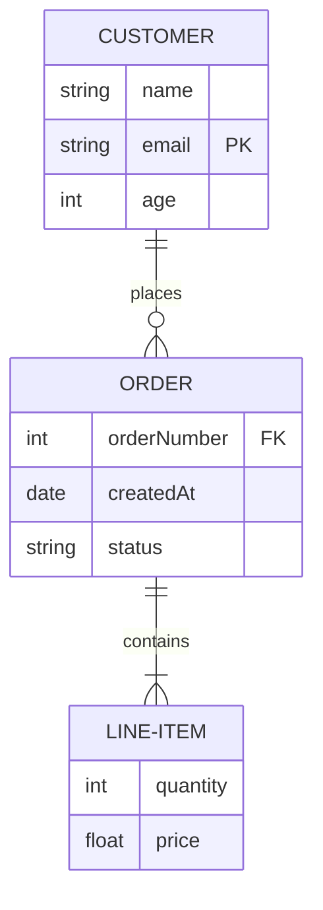

### 5.6 甘特图 Gantt

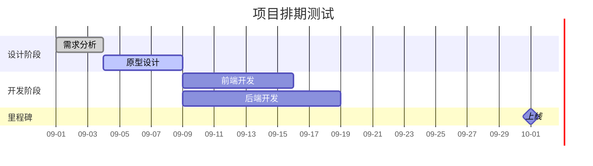

### 5.7 饼图 / 象限图

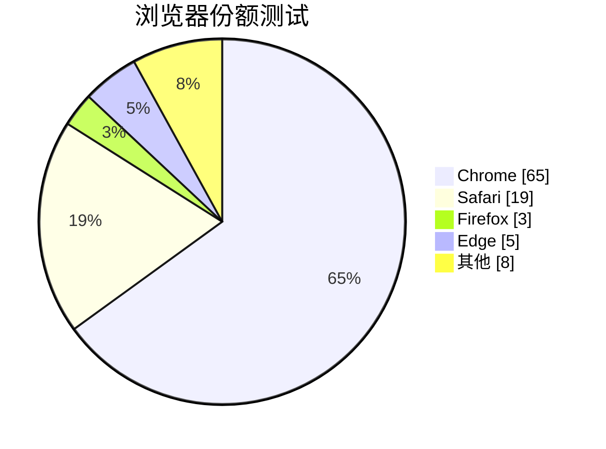

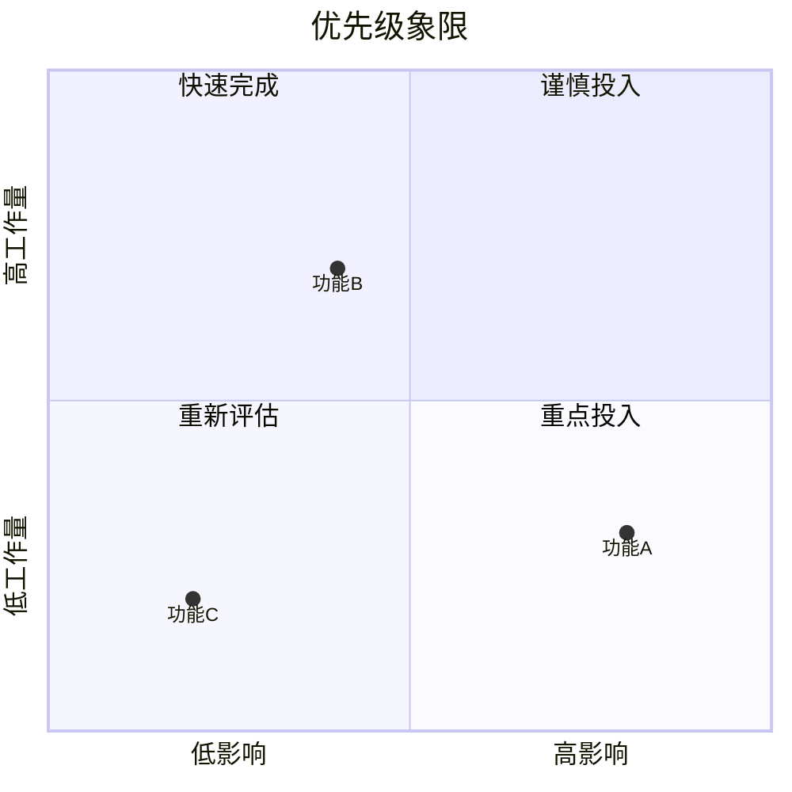

### 5.8 Git 图 / 用户旅程 / 需求图

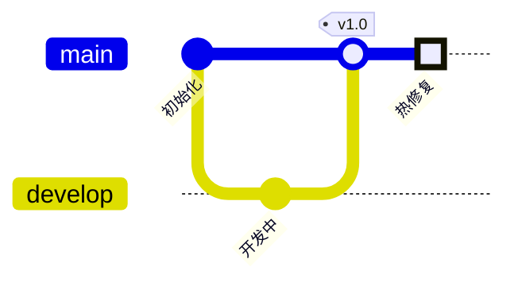

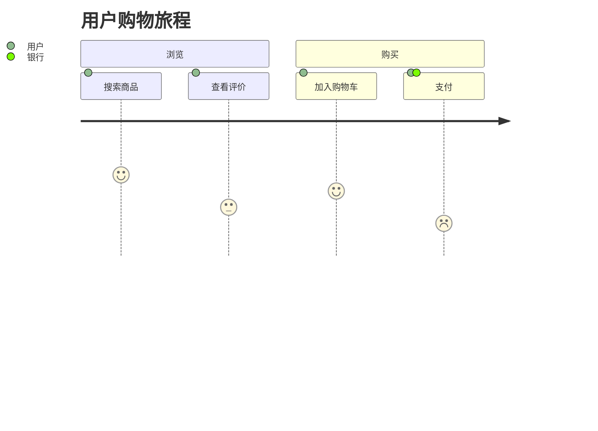

```mermaid
requirementDiagram
    requirement 登录需求 {
        id: 1
        text: 用户应能通过邮箱登录
        risk: high
        verifymethod: test
    }
    element 登录组件 {
        type: simulation
    }
    登录组件 - satisfies -> 登录需求
```

### 5.9 新图表类型（Mermaid v10/v11）

- [ ] 思维导图 Mindmap：

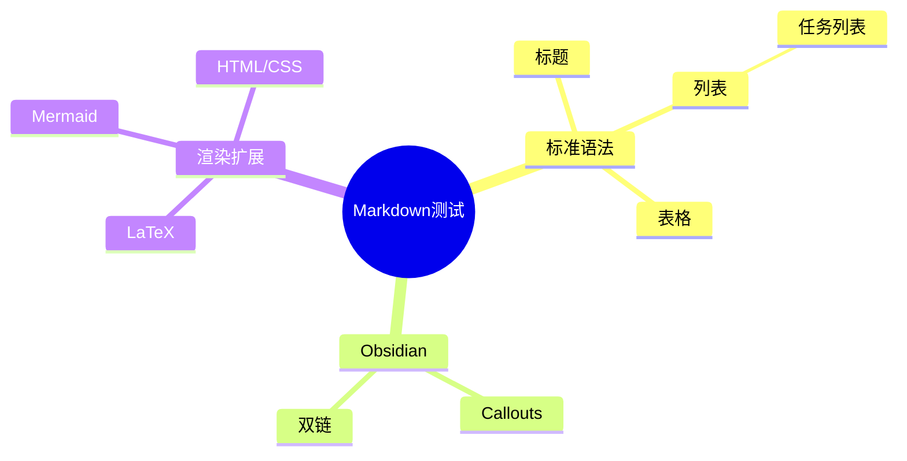

- [ ] 时间线 Timeline：

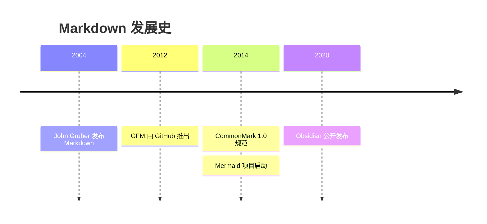

- [ ] 桑基图 Sankey（beta）：

```mermaid
sankey-beta
流量来源,着陆页,100
流量来源,博客,60
着陆页,转化,40
博客,转化,25
```

- [ ] XY 图 Xychart：

```mermaid
xychart-beta
    title "月度销量"
    x-axis [一月, 二月, 三月, 四月]
    y-axis "销量 (件)" 0 --> 100
    bar [30, 55, 42, 78]
    line [30, 55, 42, 78]
```

- [ ] C4 架构图（部分渲染器支持）：

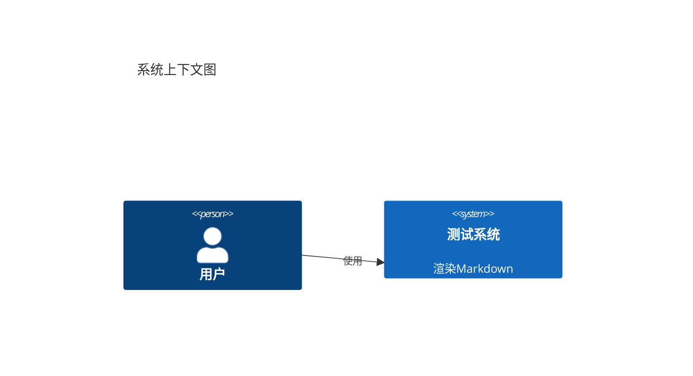

- [ ] Block 图（v11）：


### 5.10 Mermaid 容错测试

- [ ] 错误语法应显示错误信息而非白屏崩溃：

```mermaid
flowchart TD
    A[开始 --> B{未闭合节点
```

- [ ] Mermaid 中的特殊字符转义：

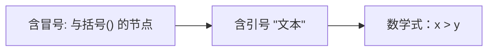

---

## 第六部分：多语法嵌套交叉工况（核心压力测试）

### 6.1 HTML 中嵌套 Markdown / LaTeX / Mermaid

- [ ] HTML 容器内嵌 Markdown（CommonMark 规定块级 HTML 内 Markdown 不解析，测试实际行为）：

<div class="md-test-card">
内部 **Markdown 粗体** 是否解析？

- 列表是否解析？
</div>

- [ ] HTML 容器内嵌 LaTeX：

<div style="border:1px solid #999;padding:8px;">
  行内公式：$\sqrt{a^2+b^2}$
  $$\sum_{i=1}^{n} i = \frac{n(n+1)}{2}$$
</div>

- [ ] details 内嵌 Mermaid（折叠图表渲染工况）：

<details>
<summary>点击展开 Mermaid 图</summary>


</details>

- [ ] details 内嵌表格与公式：

<details>
<summary>展开查看数据</summary>

| 项目 | 公式 | 值 |
|---|---|---|
| 圆面积 | $\pi r^2$ | 3.14 |
| 球体积 | $\frac{4}{3}\pi r^3$ | 4.19 |

</details>

### 6.2 Callout 中嵌套各种语法

- [ ] Callout + LaTeX + Mermaid + HTML + 代码：

> [!example]- 复杂 Callout（点击展开）
> **Markdown 粗体** 和 ==高亮== 与 [[双链]]
> 行内公式 $\alpha + \beta$，块级：
> $$\frac{d}{dx}e^x = e^x$$
> <span style="color:green;">HTML 绿色文字</span>
> ```mermaid
> flowchart LR
>   X[Callout内] --> Y[Mermaid]
> ```
> 行内代码 `code` 和任务：
> - [x] 完成
> - [ ] 未完成

### 6.3 表格单元格内嵌套复杂语法

| 测试项 | 内容 | 渲染判定 |
|---|---|---|
| 行内公式 | $\int_0^1 x\,dx = \frac{1}{2}$ | [ ] |
| 行内代码 | `` `console.log()` `` | [ ] |
| 链接+图片 | [](https://example.com) | [ ] |
| HTML | <kbd>Ctrl</kbd>+<mark>高亮</mark> | [ ] |
| 双链+标签 | [[笔记链接]] #标签 | [ ] |
| 转义管道 | `a \| b` 与 a &#124; b | [ ] |
| 多行块级公式* | $$x^2$$ | [ ] |
| 嵌套粗斜体 | ***粗斜体+`代码`*** | [ ] |

> \* 注：GFM 表格单元格内块级元素属于超纲工况，用于观察编辑器容错策略。

### 6.4 列表内嵌套复杂语法

- [ ] 多级嵌套混合体：

1. 有序项含公式 $E=mc^2$ 与代码 `x=1`
   - 无序子项含 HTML：<b>粗体</b>
     > 子项内引用块
   - 子项内含围栏代码（缩进对齐测试）：
     ```js
     // 列表内代码块
     let y = 2;
     ```
   - 子项内含表格：
     | 列1 | 列2 |
     |---|---|
     | a | b |
2. 有序项内含 Mermaid：
   ```mermaid
   flowchart LR
     P[列表内] --> Q[图表]
   ```
3. 松散列表项（空行后）内的段落：

   这是第 3 项的第二段，应保持列表编号连续性。

### 6.5 引用块内嵌套其他语法

> 引用内标题：
> ### 引用中的三级标题
> 引用内代码块：
> ```python
> print("quote")
> ```
> 引用内公式：$$\oint_C \mathbf{B}\cdot d\mathbf{l} = \mu_0 I$$
> 引用内 HTML：<span style="color:red;">红色文字</span>
> 引用内 Callout：
> > [!tip] 嵌套引用中的 Callout
> > 内容。

### 6.6 代码块与渲染的边界工况

- [ ] 代码块内的一切语法都不应被渲染（反例校验）：

```text
**不应加粗** ==不应高亮==  $不应成公式$ %%不应成注释%%
> 不应成引用  # 不应成标题  :smile: 不应成表情
```

```mermaid
flowchart TD
```

上面单独一行"```mermaid"后接"```"的空图表应显示空图或错误提示，不应崩溃。

- [ ] 行内代码中的美元符：`$not_math$` 与 `$` 单独出现不应触发公式。

### 6.7 极端与边界工况

- [ ] 超长单词不折行溢出测试：PneumonoultramicroscopicsilicovolcanoconiosissupercalifragilisticexpialidociousPneumonoultramicroscopicsilicovolcanoconiosis
- [ ] 超长 URL：https://example.com/aaaaaaaaaaaaaaaaaaaaaaaaaaaaaaaaaaaaaaaaaaaaaaaaaaaaaaaaaaaaaaaaaaaaaaaaaaaaaaaaaaaaaaaaaaaaaaaaaaaa
- [ ] 超长表格行（20列）：

| 1 | 2 | 3 | 4 | 5 | 6 | 7 | 8 | 9 | 10 | 11 | 12 | 13 | 14 | 15 | 16 | 17 | 18 | 19 | 20 |
|---|---|---|---|---|---|---|---|---|---|---|---|---|---|---|---|---|---|---|---|
| a | b | c | d | e | f | g | h | i | j | k | l | m | n | o | p | q | r | s | t |

- [ ] 深层引用嵌套（5 级）：

> 1
> > 2
> > > 3
> > > > 4
> > > > > 5

- [ ] 深层列表嵌套（8 级缩进）：

- L1
	- L2
		- L3
			- L4
				- L5
					- L6
						- L7
							- L8

- [ ] 空元素容错：空标题、空链接、空粗体、空高亮：

###

[]()

****

====

- [ ] 连续分隔线与标题冲突（`---` 紧跟文本行会变 Setext 标题的歧义测试）：

上面这行文字
---
上面两行应渲染为 Setext 二级标题而非分隔线（歧义工况）。

- [ ] RTL / 双向文本：<span dir="rtl">مرحبا بالعالم</span> 与 English 混排
- [ ] 全角符号：＃标题 全角＊强调＊ 全角｜表格
- [ ] 大量 Emoji 与 CJK 混排：🎉🎊🎈 恭喜完成测试！🀄🈶🈚 中文方块字符

---

## 第七部分：综合验收清单

| # | 测试类别 | 检查要点 | 通过 |
|---|---------|---------|------|
| 1 | 标准 Markdown | 标题/强调/列表/表格/脚注/代码 | ☐ |
| 2 | Obsidian 语法 | 双链/嵌入/Callouts/注释/高亮/Properties | ☐ |
| 3 | LaTeX | 行内/块级/矩阵/对齐/颜色/mhchem | ☐ |
| 4 | HTML | details/表格合并/媒体元素/语义标签 | ☐ |
| 5 | CSS | style块/class/hover/渐变 | ☐ |
| 6 | Mermaid | 14+ 种图表类型/新旧版本/容错 | ☐ |
| 7 | 嵌套交叉 | 表格×公式/Callout×Mermaid/列表×代码 | ☐ |
| 8 | 边界工况 | 超长文本/深层嵌套/空元素/歧义语法 | ☐ |
| 9 | 安全性 | script过滤/iframe策略/XSS | ☐ |

> [!success] 测试完成
> 若本文档所有部分均正确渲染，且第六部分交叉工况无解析冲突、无白屏、无崩溃，则该编辑器兼容性达标。

脚注回链测试：文中多处引用了 [^1]，检查脚注编号与回链箭头是否正常。
````

## 使用说明与测试建议

1. **保存方式**：将上方内容（不含最外层四反引号）保存为 `全语法测试.md`，建议放入 Obsidian Vault 中测试以启用 Wiki 链接、嵌入和 Properties。
2. **对照测试**：建议同时在 **Obsidian（最新内核 Mermaid v11+ / KaTeX）**、Typora、VS Code（Markdown All in One + Markdown Preview Mermaid Support）中打开对比，记录差异。
3. **占位资源**：文中 `via.placeholder.com` 与 `example.com` 的媒体资源仅用于测试加载失败时的降级表现（alt 文本、优雅报错）。
4. **设计要点说明**：
   - 第六部分是核心：覆盖了 **表格×LaTeX、Callout×Mermaid、details×代码块、列表×表格、引用×公式** 等最易出解析冲突的组合；
   - 包含多个**故意错误的语法**（未闭合 Mermaid、未定义 LaTeX 命令、未闭合 HTML 标签、XSS script），用于验证容错与安全性——正确行为是显示错误提示或过滤，而非白屏/弹窗；
   - 覆盖了 Obsidian 全部 **13 类 Callout**（含别名）及折叠/嵌套工况、Mermaid **v10/v11 新图表**（mindmap、timeline、sankey-beta、xychart-beta、quadrant、block-beta、C4）；
   - 边界工况部分测试了 **Setext 标题歧义、深层嵌套（8级列表/5级引用）、超长内容、空元素**等解析器易崩溃场景。